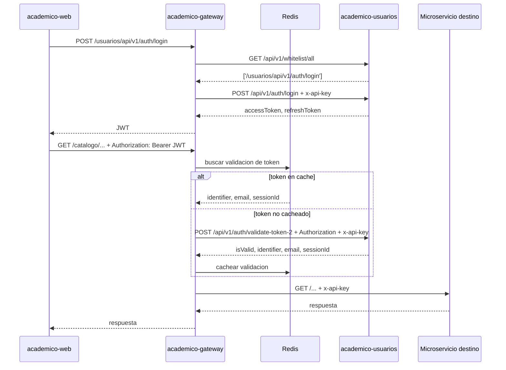

# Arquitectura gateway-auth-routing

Estado: vigente
Ultima revision: 2026-06-27
Repositorios participantes: `academico-gateway`, `academico-usuarios`, `academico-web`

## Resumen

El flujo de autenticacion y enrutamiento usa `academico-gateway` como punto de entrada unico. El microservicio `academico-usuarios` emite y valida JWT. Una vez validado el request, el gateway redirige la llamada al microservicio academico correspondiente segun el primer segmento de la ruta.

Flujo objetivo:

```text
academico-web -> academico-gateway -> academico-usuarios -> JWT
academico-web -> academico-gateway -> validacion JWT -> microservicio destino
```

## Diagrama



## Responsabilidades

### academico-web

- Consume el gateway como unica entrada publica.
- Envia credenciales al login publicado por el gateway: `/usuarios/api/v1/auth/login`.
- Persiste o administra el `accessToken` segun la politica de frontend.
- Envia `Authorization: Bearer <accessToken>` en requests protegidos.

Nota: al momento de esta documentacion, el repositorio `academico-web` solo contiene README y no codigo de aplicacion.

### academico-gateway

- Registra proxies por microservicio en `src/main.js`.
- Carga `baseUrl` y `apiKey` de cada microservicio desde variables de entorno en `src/app.module.js`.
- Usa `src/middleware/token.middleware.js` para:
  - excluir rutas publicas internas;
  - cargar whitelist desde `academico-usuarios`;
  - validar JWT contra `academico-usuarios`;
  - cachear validaciones de token en Redis.
- Usa `src/services/proxy.service.js` para:
  - extraer el nombre del microservicio desde la ruta;
  - reescribir la URL quitando el prefijo del microservicio;
  - redirigir al `baseUrl` configurado;
  - agregar `x-api-key` interna.

### academico-usuarios

- Publica `POST /api/v1/auth/login`.
- Emite `accessToken` y `refreshToken` JWT.
- Publica `POST /api/v1/auth/validate-token-2`.
- Valida el JWT usando `JWT_SECRET` o `JWT_DOC_SECRET`.
- Publica `GET /api/v1/whitelist/all` con rutas publicas consumidas por el gateway.

## Rutas principales

| Ruta publica en gateway | Destino interno | Proposito |
| --- | --- | --- |
| `/usuarios/api/v1/auth/login` | `academico-usuarios /api/v1/auth/login` | Login y emision de JWT |
| `/usuarios/api/v1/auth/validate-token-2` | `academico-usuarios /api/v1/auth/validate-token-2` | Validacion de JWT usada por gateway |
| `/{microservicio}/...` | `{MICROSERVICIO_BASE_URL}/...` | Redireccion a servicio destino |

## Variables de entorno relevantes

### Gateway

| Variable | Uso |
| --- | --- |
| `USUARIOS_BASE_URL` | URL base de `academico-usuarios` |
| `USUARIOS_API_KEY` | API key interna enviada a `academico-usuarios` |
| `CALIFICACIONES_BASE_URL` | URL base de `academico-calificaciones` |
| `CATALOGO_BASE_URL` | URL base de `academico-catalogo` |
| `MATRICULAS_BASE_URL` | URL base de `academico-matriculas` |
| `SOLICITUDES_BASE_URL` | URL base de `academico-solicitudes` |
| `GATEWAY_TOKEN_CACHE_TTL` | TTL para validaciones de token |
| `GATEWAY_WHITELIST_CACHE_TTL` | TTL para whitelist |
| `REDIS_HOST`, `REDIS_PORT`, `REDIS_PASSWORD` | Conexion a Redis |

### Usuarios

| Variable | Uso |
| --- | --- |
| `USUARIOS_API_KEY` | API key esperada en llamadas internas |
| `JWT_SECRET` | Secreto para firmar y validar JWT |
| `JWT_DOC_SECRET` | Fallback usado por el servicio si `JWT_SECRET` no existe |
| `DB_HOST`, `DB_PORT`, `DB_DATABASE`, `DB_USER`, `DB_PASSWORD` | Conexion a base de datos |

## Reglas de enrutamiento

El gateway espera que las rutas de microservicios sigan este formato:

```text
/{microservicio}/{ruta-interna-del-servicio}
```

Ejemplo:

```text
/catalogo/api/v1/materias
```

Se reenvia como:

```text
{CATALOGO_BASE_URL}/api/v1/materias
```

## Reglas de seguridad

- El login esta en whitelist para permitir obtener el primer JWT.
- Las rutas no incluidas en whitelist requieren header `Authorization`.
- El gateway no valida el JWT localmente; delega la validacion a `academico-usuarios`.
- Las llamadas internas entre gateway y servicios usan `x-api-key`.
- La validacion exitosa de token se cachea en Redis para reducir latencia y carga en `academico-usuarios`.

## Archivos de implementacion

Gateway:

- `src/main.js`: registro de proxies HTTP/gRPC.
- `src/app.module.js`: carga de configuracion y orden de middlewares.
- `src/config/services.config.js`: mapa de microservicios y modulo de seguridad.
- `src/middleware/token.middleware.js`: whitelist, validacion JWT y cache.
- `src/services/proxy.service.js`: reescritura y redireccion al servicio destino.

Usuarios:

- `src/auth/auth.controller.js`: endpoints de login y validacion.
- `src/auth/auth.service.js`: emision y verificacion de JWT.
- `src/auth/whitelist.controller.js`: rutas publicas consumidas por el gateway.
- `src/main.js`: proteccion con `x-api-key` para ConnectRPC.

## Publicacion como Azure DevOps Wiki

Usar `academico-gateway/docs` como carpeta fuente de Wiki publicada desde Git.

Convenciones:

- `docs/README.md` funciona como pagina inicial.
- Los archivos `.order` definen el orden de navegacion.
- Los cambios se aprueban por pull request.
- Los ADR se agregan como documentos nuevos; no se reescribe la historia de decisiones salvo correcciones menores.
